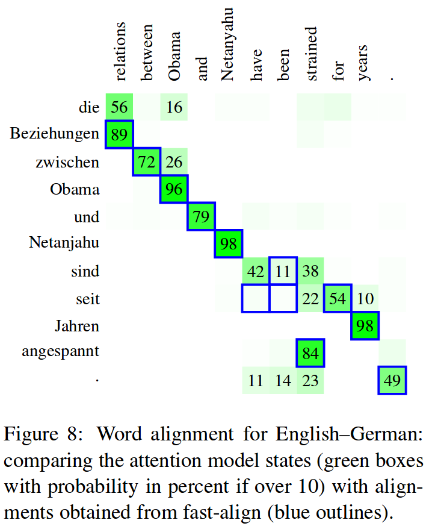
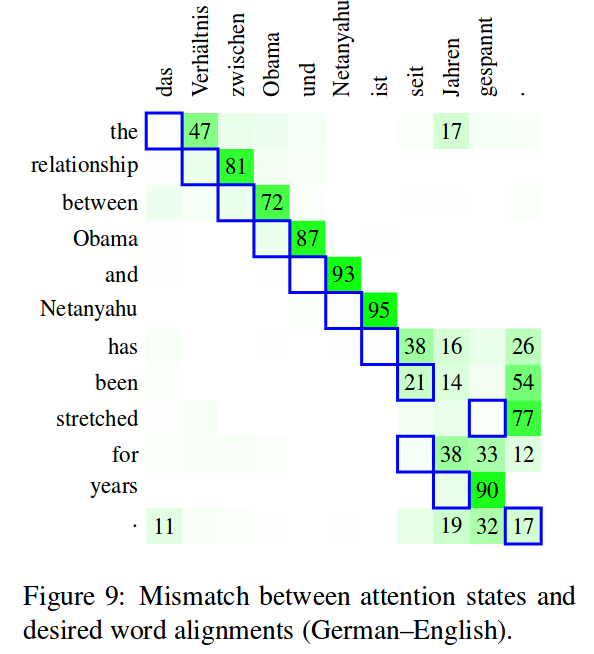

% Attention mechanisms in deep neural networks
% Martin Tutek
% \today

# Original attention mechanism and its variants

Essentially, the attention mechanism is a way to find an answer to a query. The query in this problem is a vector of real numbers, while the answer is a linear re-combination of values produced by encoding an input sequence. The attention mechanism is supposed to find the *best* linear re-combination for a given query.

- Query: $q \in \mathbb{R}^{d_q}$
- Keys: $K \in \mathbb{R}^{T \times d_k}$
- Values: $V \in \mathbb{R}^{T \times d_v}$

Where T is the time dimension (variable over different input instances), and $d_{\left\vert\cdot\right\vert}$ are the dimensions of respective embeddings. Keys and values are mapped one-to-one.

We define the _energy_ as a result of a function $f$ mapping from a key and query onto $\mathbb{R}$.

$$e_i = f(q,k_i)$$

The energy values are then normalized with a softmax function to produce a probability distribution over all keys

$$a_{i} = softmax(e_{i})$$

We then use these values as the coefficients of a linear combination over the values

$$att = \sum_i a_ih_i$$

## Usage
Initially [@bahdanau2014neural], the attention mechanism was introduced in a machine translation (sequence to sequence) problem to mitigate the problem of learning long dependencies. After a RNN encoder encoded the input sequence into a sequence of hidden states, we use the current decoder state as the query and the encoder hidden states as both the keys and the values.

Essentially, we find relevant information for the word we are currently translating in the encoded input sequence. For this to work, it is essential that the embedding spaces of the input and output vocabularies are somewhat aligned (similar words in languages should be close together).

Other examples of usage include self-attention and multi-head attention, referenced in a later chapter.

## Variants
### MLP attention 
[@bahdanau2014neural]
$f$ is *parametrized* by a feed-forward neural network (multi-layer perceptron)

$$ a_i(q, k) =  w_2^T tanh(W_1 [q;k_i])$$

- $[q;k]$ are the concatenated query and key
- $W_1$ is a linear operator
- $w_2$ is a parameter vector

### Bilinear attention
[@luong2015effective]

$f$ is parametrized by a matrix $W \in \mathbb{R}^{d_q \times d_k}$ (a bilinear operator)

$$ a(q, k) = q^T W k $$

### Dot product attention
[@luong2015effective]

$f$ is _parameter-free_, however $d_q$ **must** be equal to $d_k$.

$$ a(q, k) = q^T \cdot k $$

\pagebreak

#Extensions

## Self-attention (inter-attention)
[@cheng2016long] : The LSTMN model 
_"uses attention to induce relations between tokens"_

Idea: use attention over previous LSTM states (keys, values) with the current LSTM state as the query.

$$ a_i^{(t)} = v^T tanh(W_hh_i + W_xx^{(t)} + W_{\hat{h}} \hat{h}^{(t-1)}) $$
$$ s_i^{(t)} = softmax(a_i^{(t)})$$

Where $x^{t}$ is the current input, $\hat{h}^{(t-1)}$ the hidden state in the **previous timestep**, $v$ a parameter vector and $h_i$ the previous hidden states (i < t - 1).

**Note**: only the hidden state $h$ is used in the computation, and not the cell state $c$!

Then the state vectors ($c, h$) are updated:

\begin{equation}
\begin{bmatrix}
  \hat{h}^{t}\\
  \hat{c}^{t}
\end{bmatrix}
= 
\sum_{i=1}^{t-1} s_i^{(t)}
\begin{bmatrix}
  h_i\\
  c_i
\end{bmatrix}
\end{equation}

and then replace the un-altered state vectors in further LSTM computations.

**Attention fusion:** 
how to use self-attention in a sequence-to-sequence task where a decoder network, along with using self-attention, queries the encoder network (intra-attention).

* **Shallow attention fusion**
treats the LSTMN model as a standard LSTM and uses intra-attention on top of it.

* **Deep attention fusion**
adds an additional gating mechanism into the LSTM cell update based on intra-attention. Formula in chapter 4 of paper.

## A structured self-attentive sentence embedding
[@lin2017structured]

1. Run embedded sentence through BiLSTM
2. Self-attention over the BiLSTM hidden states
3. Use a MLP for a downstream task

**Attention**: 

(1) a MLP attention with a tanh hidden layer as in (1.2.1) 
(2) _Matrix attention_ -- the second weight of the attention MLP is a matrix instead of a vector, resulting in a matrix aggregation instead of a vector

$$
A = softmax(W_2 tanh(W_1 H^T)) 
$$

Where the softmax is applied along the second dimension of the input. The MLP has no bias! The matrix A is then multiplied with the matrix of hidden states (of dim $T\times H$), resulting in a sentence embedding matrix $M = AH$

We expect (hope) that the sentence embedding matrix will capture different aspects, however this is not necessary the case since the matrix $M$ can _"suffer from redundancy problems"_. The authors attempt to mitigate this by introducing a regularization penalty term $P$.

$$
P = \left\lVert (AA^T - I) \right\rVert_F^2
$$

----------------------------------------

**Intermezzo: Frobenius norm**: 

The Frobenius or Hilbert-Schmidt norm of the matrix A is defined as:

\begin{equation}
\begin{aligned}
\left\lVert A \right\rVert_F &= \sqrt{\sum_i^m \sum_j^n \left\vert a_{ij} \right\vert^2}\\
& = \sqrt{trace(A^TA)}\\
& = \sqrt{\sum_i^{\min\{m,n\}} \sigma_i^2(A)}\\
\end{aligned}
\end{equation}
where $\sigma_i$ is a singular value of $A$. 

-----------------------------------------

**Effect of regularization**:

The matrix A is row-normalized (each out of $r$ rows should focus on one aspect), and each row represents one module of attention. The matrix $AA^T$ contains the dot products of $\mathbf{a_i}$ and $\mathbf{a_j}$ on the location $i, j$. Obviously, the matrix $AA^T$ is a square matrix with diagonal elements equal to one (since $i$ = $j$), therefore the subtraction of the identity matrix.

The remainder of the dot products can be seen as a measure of similarity between two discrete probability distributions over the same discrete space (the input sequence). The dot product of the pdfs produces a number between 0 and 1, 0 meaning the distributions are completely different, and 1 meaning they are equal. Therefore, the larger the overlap between the distributions, the higher the penalty is going to be.

**Experiments**: Yelp dataset, Age dataset, SNLI (\* SNLI model described)

## Incorporating Structural Alignment Biases into an Attentional Neural Translation Model
[@cohn2016incorporating]

**Fertility**: each instance of source word is translated to a consistent number of tokens in the target language (IBM Models 3, 4, 5)

**Absolute positional bias**: word order is similar in source and target

**Relative position bias**, **alignment consistency**.

**Note**: Good description of attention in NMT.

Attention used: MLP attention (1.2.1), but with different notation

$$
f_{ji} = \mathbf{v}^T tanh(W^{ae} \mathbf{e}_ i + W^{ah} g_{j-1}) 
$$

Where $f_{ji}$ is the **energy** (before) between $g_{j-1}$, the target hidden state and $e_i$, the source encoding. The MLP has size $A$, and the dimensions of the parameters are:
$W^{ae} \in \mathbb{R}^{A\times 2h}$, $W^{ah} \in \mathbb{R}^{A\times h}$ (decoder is unidirectional) and $\mathbf{v} \in \mathbb{R}^A$.

Standard attention follows:

$$
\alpha_j = softmax(\mathbf{f}_ j)
$$

$$
c_j = \sum_i \alpha_{ji} \mathbf{e}_ i
$$

**Incorporating position bias:** 

a word at a relative position in the source aligns to a similar relative position at the target (A: obviously dependent on language pairs): $\frac{i}{I} \approx \frac{j}{J}$ [@dyer2013simple].

$$
f_{ji} = \mathbf{v}^T tanh(W^{ae} \mathbf{e}_ i + W^{ah} g_{j-1} + 
 \underbrace{W^{ap} \psi_{j, i, I}}_ {\text{pos bias}})
$$

$$
\psi_{j, i, I} = \left\lbrack log(1+j), log(1+i), log(1+I) \right\rbrack
$$
where, obviously, $W^{ap} \in \mathbb{R}^{A\times 3}$

* Target length $J$ is excluded as it is unknown during encoding.
* $log1p$ _"avoids numerical instabilities"_

**Incorporating Markov condition:**

Add another parameter to the already known MLP attention equation:

$$
f_{ji} = \mathbf{v}^T tanh(W^{ae} \mathbf{e}_ i + W^{ah} g_{j-1} + W^{ap} \psi_{j, i, I}
 + \underbrace{W^{am} \xi (\alpha_{j-1};i)}_ {\text{markov param}})
$$

Where $\alpha_{j-1}$ is the **previous** attention vector. Since the length of that vector is dynamic (and therefore can't be fit by a single parameter matrix), the authors restrict themselves to using only local offset by $\pm k$ positions:

$$
\xi (\alpha_{j-1};i) = \lbrack \alpha_{j-1, i-k}, \ldots \alpha_{j-1, i}, \ldots \alpha_{j-1, i+k} \rbrack
$$ 
where, $W^{am} \in \mathbb{R}^{A\times (2k+1)}$

**Fertility**:

- the propensity for a word to be translated as a consistent number of words in the other language

**Bidirectional translation**:

Idea: attention should be roughly similar in forward and backward directions -- train so that there's a bonus for the trace of the product of attention matrices (which is bounded above by $min(I,J)$ and $\ge 0$)

$$
B = - tr(A^T_{X\to Y} A_{Y\to X})
$$

the total loss is then the sum of two unidirectional translations reduced by the attentional bonus:

$$
\mathbb{L} = -log p(\mathbf{t}|\mathbf{s}) - log p(\mathbf{s}|\mathbf{t}) + \gamma B
$$

## Attention is off-by-one
**Six Challenges for Neural Machine Translation**, chapter **3.5**
[@koehn2017six]

Challenge **5.** _The attention model for NMT does not always fulfill the role of a word alignment model, but may in fact dramatically diverge._

{#id .class height=280px}\ {#id .class height=280px}

However, as mentioned in the paper, this **misalignment is an outlier unique to German--English** translation to a larger scale and to a lesser scale otherwise.

## Hard attention
**Show, Attend and Tell: Neural Image Caption Generation with Visual Attention**, chapters **3** and **4**
[@xu2015show]

Add a parameter $Z_{\left\vert \cdot \right\vert} \hat{z}_ t$ to the standard LSTM formulation which is a dynamic representation of the relevant part of the image input at timestep $t$.

**LSTM Reformulation**
$$
a_{\left\vert \cdot \right\vert} = \sigma (W_{\left\vert \cdot \right\vert} y_{t-1} + 
                                           U_{\left\vert \cdot \right\vert} h_{t-1} + 
                                           Z_{\left\vert \cdot \right\vert} \hat{z}_ t)
$$
$$
f, i, \hat{c}, o = a_{\left\vert \cdot \right\vert}(y_{t-1},h_{t-1},\hat{z}_ t)
$$
$$
c_t = f_t \odot c_{t-1} + i_t \odot \hat{c}_ t
$$
$$
h_t = o_t \odot tanh(c_t)
$$

$\hat{z}_ t$ is computed via an attention mechanism from a set of _annotation vectors_ ${a_1,\ldots,a_L}, a_i \in \mathbb{R}^D$ obtained as a result of a CNN embedding different regions of the input image. $y_t$ are the output words which constitute a caption.

**Computing attention**

At each timestep of generating the output caption, we attend to a certain region of the image $a_i$.

$$
e_{ti} = f_{att}(a_i, h_{t-1})
$$
$$
\alpha_ {ti} = softmax(e_{ti})
$$
$$
\hat{z}_ t = \phi (\{\mathbf{a}_ i\}, \{\alpha_ i\})
$$

e.g. in classic attention, $\phi$ is a linear combination.

**Note**: LSTM cell states are initialized to an average of the annotation vectors, passed through two MLPs (one for $c_0$, one for $h_0$)

**Note**: when generating the next word, instead of a classifier on top of the output state, a deep output layer [@pascanu2013construct] is used as follows:
$$
p(y_t|a, y_t^{t-1}) \propto exp(L_o(Ey_{t-1} + L_hh_t +L_z\hat{z}_ t))
$$

**Learning hard attention**

When the probabilities for attention over each region $\{\alpha_i^n\}$ are computed, sample a concrete location $\hat{s}^n_t$ to focus on from a Multinoulli distribution parametrized by $\alpha$.

$$
\hat{s}^n_t \sim Multinoulli_L(\{\alpha_i^n\})
$$

and use the REINFORCE [@williams1992simple] learning rule to estimate the gradient. This results in the following gradient estimate:

$$
\frac{\partial \mathbb{L}}{\partial W} \approx \frac{1}{N} \sum_{n=1}^N \left[ \frac{\partial log p(y|\hat{s}^n, a)}{\partial W} 
+ log p(y | \hat{s}^n, a) \frac{\partial log p(\hat{s}^n | a)}{\partial W} \right]
$$

Since the REINFORCE rule produces gradient estimates with high variance, a number of techniques are used to reduce the variance, such as Baselines [@weaver2001optimal] which uses a moving average of previously seen log likelihoods:

$$
b_k = 0.9 \times b_{k-1} + 0.1 \times log p(y | \hat{s}_ k, a)
$$

another technique to further reduce the estimator variance is adding the gradient of the entropy $E[$ of the Multinoulli distribution to the REINFORCE loss expression, resulting in:

$$
\frac{\partial \mathbb{L}}{\partial W} \approx \frac{1}{N} \sum_{n=1}^N \left[ \frac{\partial log p(y|\hat{s}^n, a)}{\partial W} 
+ \underbrace{\lambda_r log p(y | \hat{s}^n, a) \frac{\partial log p(\hat{s}^n | a)}{\partial W}}_ {\text{reinforce contribution}}
+ \underbrace{\lambda_e \frac{\partial H[\hat{s}^n]}{\partial W}}_ {\text{entropy contribution}} \right]
$$

$\lambda_r$ and $\lambda_e$ are learned by cross-validation.

**another** improvement to robustness of this training rule is that with $p=0.5$, for a given image, the sampled location $\hat{s}$ is set to the expected value $\alpha$ (equivalent to deterministic attention).

## Dynamic coattention networks for QA
[@xiong2016dynamic]

LSTM encoder (one!) for document and question
Additional non-linear layer on top of question encoding

-- Sentinel vectors! [@merity2016pointer] added to end of each encoded sequence

$$
d_t = LSTM_{enc}(d_{t-1}, x_t^D)
$$

$$
q_t = LSTM_{enc}(q_{t-1}, x_t^Q)
$$

$$
Q = tanh(W^{(Q)} Q' + b^{(Q)})
$$

**Coattention encoder**:

Attends to the document and the question simultaneously

1. Compute affinity matrix between document and question words

$$
L = D^T Q \in \mathbb{R}^{(m+1)\times (n+1)}
$$
After normalizing the affinity matrix row-wise, we get the attention weights $A^Q$ for each word in the question, and when normalizing column-wise the attention weights for each word in the document $A^D$.

Summaries (attention contexts) are computed by multiplying the document representation with respect to each word in the question

$$
C^Q = DA^Q \in \mathbb{R}^l\times (n+1)
$$

Then, compute $C^D$, a co-dependent representation of the question and document as the coattention context. The query and the summary are concatenated horizontally.

$$
C^D = [Q;C^Q] A^D \in \mathbb{R}^{2l\times (m+1)}
$$

The last step: run a Bi-LSTM over the concatenated document and codependent representation:

$$
u_t = BiLSTM(u_{t-1}, t_{t+1}, [d_t; c_t^D]) \in \mathbb{R}^{2l}
$$

$U=[u_1, ..., u_m] \in \mathbb{R}^2l\times m$ is then used as the foundation for selecting the span for the best possible answer.

**Dynamic pointing decoder**:

Producing the answer span in SQuAD:= predicting the start and end points of the span.

The dynamic decoder is a faux state machine whose statei s maintained by a LSTM based model. 

$$
h_i = LSTM_{dec}(h_{i-1}, [u_{s_{i-1}};u_{e_{i-1}}])
$$

where $u_s$ and $u_e$ are the representations of the previous estimates oft he start and end positions in the coattention encoding ($U$))

Then, two Highway Maxout Networks (maxout networks with highways) are used to compute the predicted start and end locations. The loss is the cumulative softmax cross-entropy of the start and ent points across all iterations. The iterative LSTM-HMN procedure stops when both the start and end estimate don't change, or a maximum number of iterations is reached.

## Attention-over-Attention
[@cui2016attention]

- Document, query $\in R^{\left\vert \mathbb{D} \right\vert \cdot 2h}, R^{\left\vert \mathbb{Q} \right\vert \cdot 2h}$
- $D, Q$ are sequence lengths of document and query respectively
- Shared embedding spaces for query and document (uses one embedding matrix for their joined vocabulary)
- two BiGRU embed query and document ($h_{doc} \in D\cdot 2h$, $h_{query} \in Q \cdot wh$)
- matrix multiplication over the shared embedding dimension $2d$ produces the `pair-wise matching score`
$$M = h_{doc}^T \cdot h_{query} \in R^{DxQ}$$

CONT

# References
